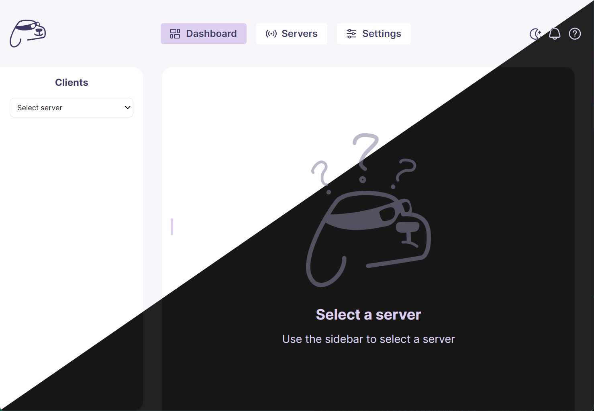
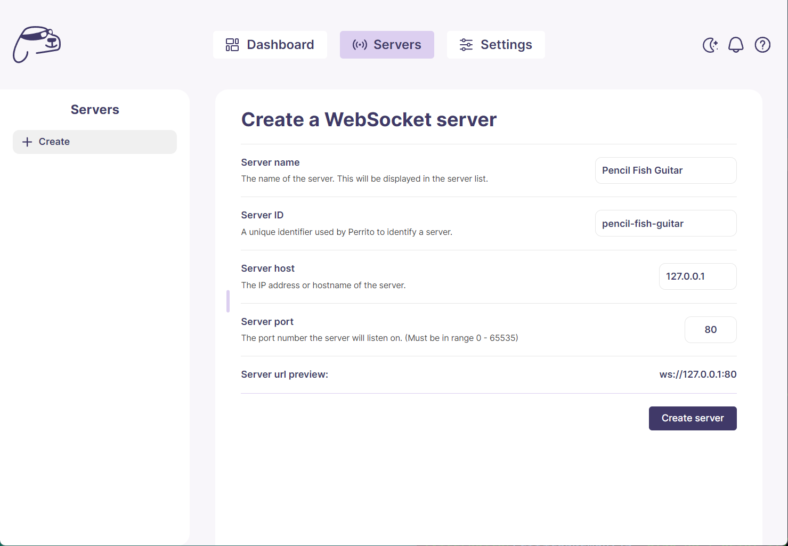
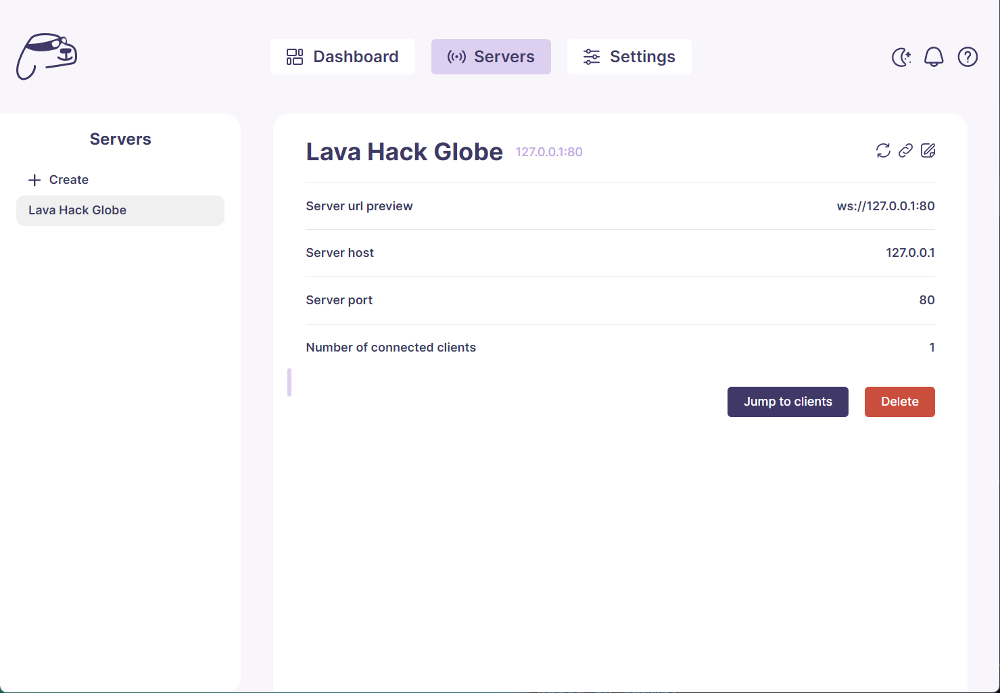
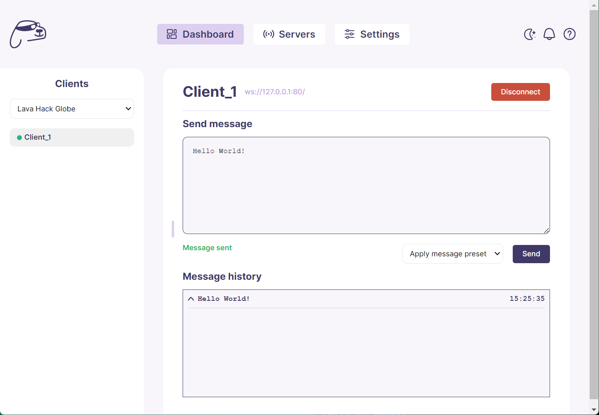

  
   
  
  
   
   
  <h1>Perrito</h1>

Perrito WS (referred to as Perrito) is a WebSocket server and GUI combo enabling devs to streamline WebSocket client testing and development. Quick setup, real-time interaction, and easy monitoring make it a go-to for building and debugging WebSocket connections.

## Table of Contents

- [Features](#features)
- [Installation](#installation)
- [Getting Started](#getting-started)
- [Screenshots](#screenshots)
- [Contributing](#contributing)
- [License](#license)

## Features

- 🛜 **Multiple Server Instances**: Run multiple WebSocket servers concurrently on different IP addresses and ports.
- 🎨 **Customization**: Easily configure server defaults, message presets, and more!
- 💬 **Real-time Interaction**: Immediate WebSocket client feedback and interaction through a user-friendly GUI.
- ⌨️ **Keybinds**: Master Perrito's keybinds and set up WebSocket servers in seconds

## Installation

1. Download the binary suitable for your operating system in the [releases](https://github.com/KAIKAKU-AI/perrito-ws/releases) section on GitHub
2. Run the setup installer
3. Search and run `Perrito`

## Getting Started

The [Perrito wiki](https://github.com/KAIKAKU-AI/perrito-ws/wiki) contains a very useful getting started guide for anyone new to Perrito.

## Screenshots

## Contributing

Interested in contributing? Great! Please check out our [contributing guidelines](CONTRIBUTING.md).

## License

Distributed under the GNU General Public v3 license. See [LICENSE](LICENSE) for more information.

Made with 💖 by the team at <a href="https://kaikaku.ai">KAIKAKU</a>

